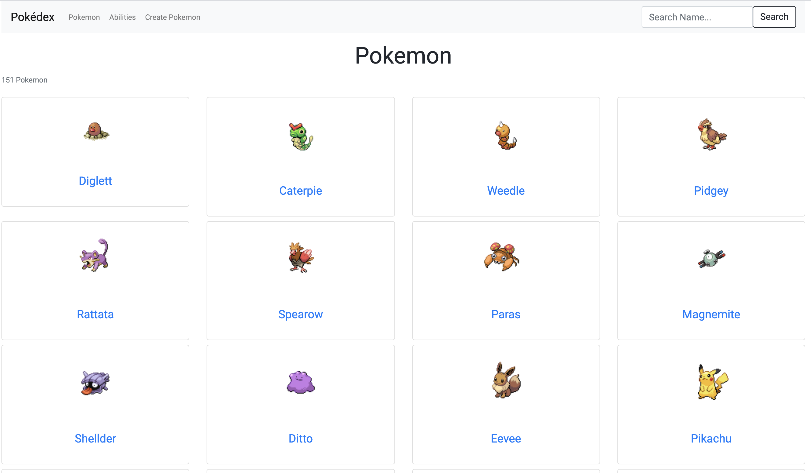
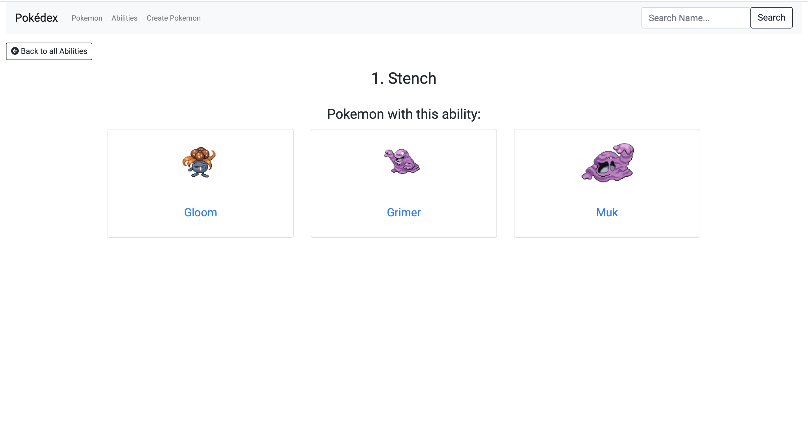
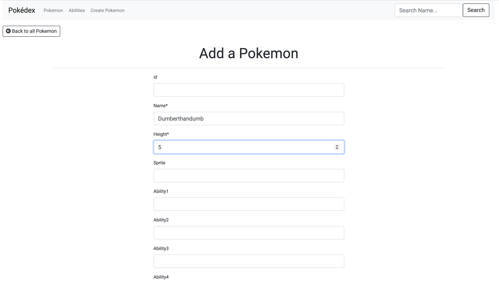

# Pokédex

This aplication shows all the original 151 Pokemon and their abilities. Created using the [PokéApi](https://pokeapi.co/).

## Features

### Existing Features

#### Navigation Bar

The navbar stays the same across all pages and makes navigating the app straightforward. There is a link to the Pokemon/Home page and the Abilities page. There is also a search input which allows users to search for specific Pokemon by name.

#### Pokemon/Home Page


Shows all 151 pokemon ordered by height (smallest to largest). The image of each pokemon gets larger depending on how tall the Pokemon is. 

In the top left of the page there is a total count showing the number of results (151 by default as there are 151 kanto Pokemon).

The name of each Pokemon links to a more detailed page for that Pokemon.

#### Pokemon Details Page


Shows an image of the specified Pokemon, the id, the height, and all the abilities (if applicable). Each ability links to a more detailed page for that ability.

Has a button in the top left that will take the user back to the Pokemon/Home page.

#### Abilities Page


Shows all 327 abilities ordered by id.

In the top left of the page there is a total count showing the number of results (327 as there are currently 327 abilities).

The name of each ability links to a more detailed page for that ability.

*Still under construcion: Also shows the number of Pokemon with the ability and the total height of all Pokemon that have that ability.* 

#### Ability Details Page


Shows all the Pokemon (if any) with this ability. 

Has a button in the top left that will take the user back to the Abilities page.

#### Add Pokemon Page


A form that allows the user to create a new Pokemon and it to the database. 

Has a button in the top left that will take the user back to the Pokemon/Home page.


### Hopeful Future Features

* Ability to count total height of all Pokemon with a certain ability
* Ability to count total amount of Pokemon with a certain ability
* Ability for the search bar to search and update results while typing

## Technologies Used

### API's

* [PokéApi](https://pokeapi.co/)

### Languages

* HTML5
* CSS3
* Python
* Jinja2

### Libraries/Frameworks

* Django : Main web framework used.
* Bootstrap : Used for initial styling.
* Google Fonts : Used for the font on the website.
* Font Awesome : Used for back icons.

### Tools

* Visual Studio Code : The code editor used for this project.
* Git : Installed on VS Code to allow version control.
* Github : Used to host the repositories for this project.

### Databases

* SQlite3 - The database used when in development

## Deployment

### Cloning

#### Clone the repository and run locally:

1. Navigate to the repository from the Github Dashboard
2. Select the green button in the top right of the screen that says "Clone or download"
3. Click on the clipboard icon to the right of the URL to copy it
4. Open an Integrated Development Environment (IDE) and head over to the terminal
5. Change the directory to where you want to clone the repository to
6. Execute the following command by pasting in the URL you copied in step 3: git clone https://github.com/debrawolford/pokedex.git
7. Press Enter
8. The site will then be cloned
9. Install all the project dependencies by typing pip install -r requirements.txt
10. Create an env.py file in your root directory.
11. Add env.py file to the.gitignore file.
12. Add the following to your env.py file with the applicable variables:

Key | Value
----| ----
SECRET_KEY | Your secret key used for your Django project

#### Steps to set up database
1. Open terminal in your IDE and set up the models by typing: 
python3 manage.py makemigrations 
2. Press Enter.
3. Type: 
python3 manage.py migrate
4. Press Enter.
5. Load Abilitiies fixture into database by typing:
python3 manage.py loaddata abilities_json.json
Press Enter.
6. Load Pokemon fixture into database by typing:
python3 manage.py loaddata pokemon_json.json
Press Enter.

#### Create superuser to access admin
1. Open terminal in your IDE and type: 
python3 manage.py createsuperuser
2. Follow instructions to enter username/email/password


## Script used to extract data from PokéAPi

```
import json
import requests

offset = 0
limit = 20
results = []

while offset <= 140:
    response = requests.get(f'https://pokeapi.co/api/v2/pokemon/?limit={limit}&offset={offset}')
    response_json = response.json()
    for pokemon in response_json["results"]:
        name = pokemon["name"]
        url = pokemon["url"]
        res = requests.get(f'{url}')
        res_json = res.json()
        height = res_json["height"]
        _id = res_json["order"]
        sprite = res_json["sprites"]["front_default"]
        if len(res_json["abilities"]) == 0:
            data = {
                'name': name,
                'height': height,
                '_id': _id,
                'sprite': sprite
            }
        elif len(res_json["abilities"]) == 1:
            ability1 = res_json["abilities"][0]["ability"]["name"]
            data = {
                'name': name,
                'height': height,
                '_id': _id,
                'sprite': sprite,
                'abilities': {
                    'ability1': ability1
                }
            }
        elif len(res_json["abilities"]) == 2:
            ability1 = res_json["abilities"][0]["ability"]["name"]
            ability2 = res_json["abilities"][1]["ability"]["name"]
            data = {
                'name': name,
                'height': height,
                '_id': _id,
                'sprite': sprite,
                'abilities': {
                    'ability1': ability1,
                    'ability2': ability2
                }
            }
        elif len(res_json["abilities"]) == 3:
            ability1 = res_json["abilities"][0]["ability"]["name"]
            ability2 = res_json["abilities"][1]["ability"]["name"]
            ability3 = res_json["abilities"][2]["ability"]["name"]
            data = {
                'name': name,
                'height': height,
                '_id': _id,
                'sprite': sprite,
                'abilities': {
                    'ability1': ability1,
                    'ability2': ability2,
                    'ability3': ability3
                }
            }
        elif len(res_json["abilities"]) == 4:
            ability1 = res_json["abilities"][0]["ability"]["name"]
            ability2 = res_json["abilities"][1]["ability"]["name"]
            ability3 = res_json["abilities"][2]["ability"]["name"]
            ability4 = res_json["abilities"][2]["ability"]["name"]
            data = {
                'name': name,
                'height': height,
                '_id': _id,
                'sprite': sprite,
                'abilities': {
                    'ability1': ability1,
                    'ability2': ability2,
                    'ability3': ability3,
                    'ability4': ability4
                }
            }
        results.append(data)
    if offset < 120:
        offset += 20
    else:
        limit = 11
        offset += 20
    if len(results) == 151:
        with open('pokemon_json.json', 'w') as f:
            json.dump(results, f, indent=2)


response_a = requests.get('https://pokeapi.co/api/v2/ability?limit=1000')
response_a_json = response_a.json()
results_abilities = []

for a in response_a_json['results']:
    ability = a['name']
    url = a['url']
    res = requests.get(f'{url}')
    res_json = res.json()
    id = res_json['id']
    data = {
        'model': 'pokemon.Ability',
        'pk': 1,
        'fields': {
            'name': ability,
            'id': id
            }
        }
    results_abilities.append(data)

with open('abilities_json.json', 'w') as f:
    json.dump(results_abilities, f, indent=2)
```